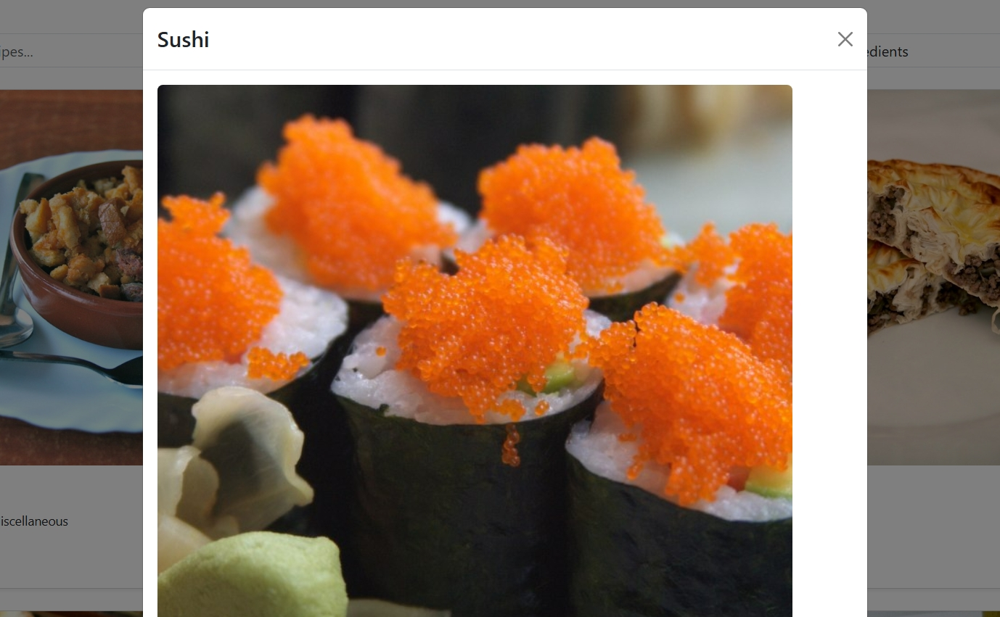
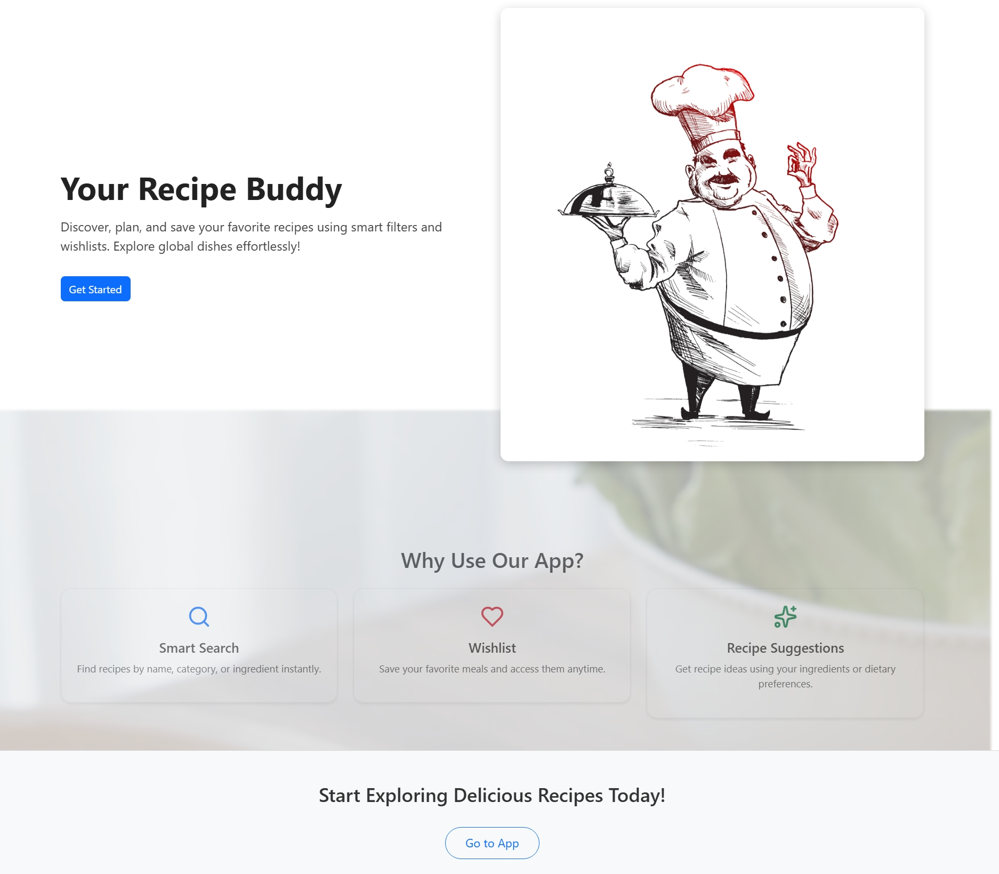
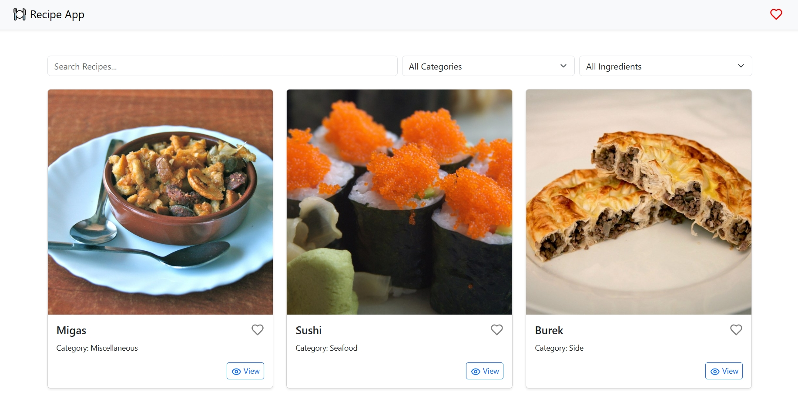
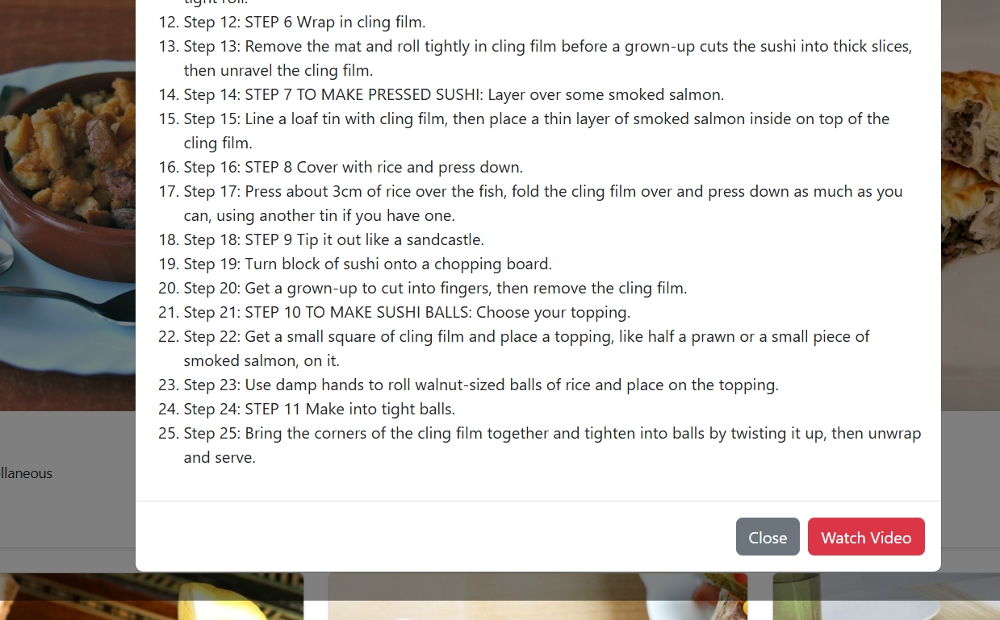
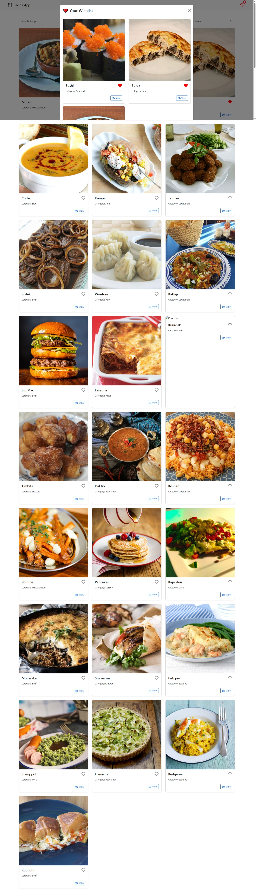

Project Title
Modern Recipe Finder Web Application with Wishlist and Filters

🔍 Problem Statement
Users often struggle to find and manage recipes based on their available ingredients or preferences. Existing apps are either cluttered, lack instant filtering, or do not support persistent wishlists. There is a need for a clean, responsive, and user-friendly web app where users can:

Search for recipes instantly

Filter by categories or ingredients

View complete recipe details in a modal

Save favorites persistently (wishlist)

Access a visually appealing UI with modern animation

🎯 Objectives
✅ Fetch and display recipes from TheMealDB API

✅ Implement real-time search as users type

✅ Filter recipes by category and ingredient

✅ View recipe details in a modal

✅ Add/remove recipes to a persistent wishlist using localStorage

✅ Create a modern Landing Page with animation/video background

✅ Apply clean and responsive UI with Bootstrap + Custom CSS

🧰 Tech Stack
Layer	Technology
Frontend	React.js
Styling	Bootstrap 5, Custom CSS
API Source	TheMealDB (public API)
Storage	LocalStorage (for wishlist)
UI Elements	React-Bootstrap, Lucide Icons

🗂️ Features Overview
✅ Core Features
Feature	Status
Real-time search by meal name	✅
Filter by meal category	✅
Filter by ingredient	✅
Recipe detail in modal	✅
Persistent wishlist (localStorage)	✅

💅 UI/UX Enhancements
Enhancement	Status
Responsive grid using Bootstrap	✅
Modern landing page with intro text	✅
Video background with dark overlay	✅
Hover/active animation on recipe cards	✅
Custom colored tags/badges	✅

🧪 Modules
AppNavbar – Top navbar with brand and wishlist button

SearchBar – Input + dropdown filters for category & ingredient

RecipeCard – Single meal card with heart icon for wishlist

RecipeModal – Modal popup showing full recipe

WishlistModal – Shows user's saved (favorited) meals

HomePage – Main logic: fetch, filter, search, wishlist

LandingPage – Hero section with animation/video background

🧠 User Flow
User lands on a modern animated landing page.

Clicks “Explore Recipes” → navigates to HomePage.

Starts typing a meal name → instant results shown.

Optionally filters by category or ingredient.

Clicks on a card → recipe opens in modal.

Clicks ❤️ to add/remove from wishlist (saved in localStorage).

Opens wishlist anytime from navbar.

📈 Future Enhancements
🔐 Firebase or Google login to sync wishlist across devices

🌐 Pagination or infinite scroll for large data

📷 Upload custom user recipes

🧠 AI meal recommendations (OpenAI / LLMs)

🧾 Meal Planner (weekly scheduling)

✅ Project Status:
Complete MVP (Minimum Viable Product) with search, filters, and wishlist is ready.
Design is responsive, persistent, and user-friendly.
   